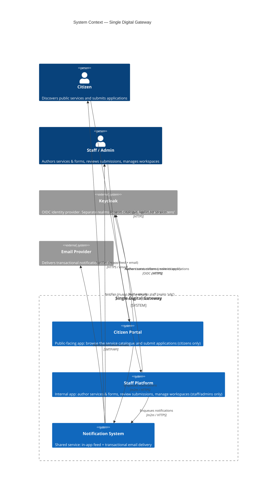

# C4 — System Context

The Single Digital Gateway (SDG) is delivered as **two separate applications** — a
**Citizen Portal** for citizens to discover and apply for public services, and a
**Staff Platform** for staff/admins to author those services, review submissions, and
manage workspaces. Each audience uses only its own application. Authentication is
delegated to **Keycloak** (separate OIDC realms per audience), and a shared
**Notification System** notifies users out-of-band.

## Actors, systems & external dependencies

| Element                 | Description                                                                                                                                                                                   |
| ----------------------- | --------------------------------------------------------------------------------------------------------------------------------------------------------------------------------------------- |
| **Citizen**             | End user browsing the published service catalogue and submitting applications. Uses **only** the Citizen Portal; authenticates against the Keycloak `citizens` realm.                         |
| **Staff / Admin**       | Internal user authoring services, forms and service agreements, reviewing submissions, and administering workspaces. Uses **only** the Staff Platform; authenticates against the `sdg` realm. |
| **Citizen Portal**      | The public-facing application (SPA + BFF). No workspace concept is exposed to the caller.                                                                                                     |
| **Staff Platform**      | The internal application (SPA + BFF) for authoring and review, including the admin shell.                                                                                                     |
| **Notification System** | Shared server-to-server service both applications enqueue into; owns the in-app feed and drains the email outbox.                                                                             |
| **Keycloak**            | External OIDC identity provider. Realm-per-audience means a citizen token can never be used against the Staff Platform.                                                                       |
| **Email Provider**      | External transactional email channel drained by the Notification System.                                                                                                                      |

> Each audience interacts with a **distinct application**; they are separated all the
> way down — separate SPAs, separate BFFs, and separate Keycloak realms. The
> [container diagram](./02-container.md) shows the SPA + BFF pair behind each.
