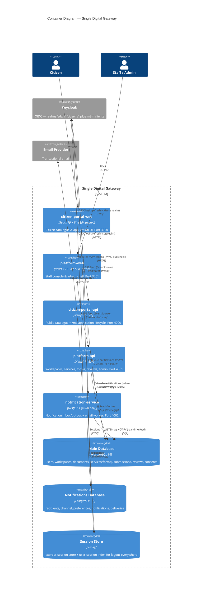

# C4 — Container Diagram

Each audience gets its own **SPA + BFF** pair (structurally identical, differ only by
config). Both BFFs share `@repo/nestjs` and the same Postgres via `@repo/database`.
A separate **notification-service** owns its own Postgres. Tokens never reach the
browser — only an httpOnly session cookie backed by **Valkey**.

## Containers

| Container                  | Tech                                               | Responsibility                                                                                                                             |
| -------------------------- | -------------------------------------------------- | ------------------------------------------------------------------------------------------------------------------------------------------ |
| **platform-web**           | React 19, Vite, TanStack Router/Query, Tailwind v4 | Staff console (`/app` workspace-scoped) + admin shell (`/admin`). Consumes `@repo/ui` + `@repo/react`.                                     |
| **citizen-portal-web**     | React 19, Vite, TanStack                           | Public service catalogue + `/me` application flow.                                                                                         |
| **platform-api**           | NestJS 11, CJS, SWC                                | Staff BFF: workspaces, services/forms authoring, reviews, service agreements, admin. OIDC BFF session against `sdg` realm.                 |
| **citizen-portal-api**     | NestJS 11                                          | Citizen BFF: `@Public` catalogue + auth-only `/me/applications` lifecycle, server-side submit validation (Ajv).                            |
| **notification-service**   | NestJS 11 (m2m only)                               | Server-to-server notification ingestion (idempotent inbox), per-channel fan-out (outbox), in-app feed + email worker. No browser sessions. |
| **Main Database**          | PostgreSQL 16 + Drizzle                            | Shared staff/citizen data. Layered drizzle-kit migrations; generated status columns; composite-FK cross-table enforcement.                 |
| **Notifications Database** | PostgreSQL 16 + Drizzle                            | Isolated notification store; `user_id` is an opaque uuid (no cross-DB FK).                                                                 |
| **Session Store**          | Valkey                                             | `connect-redis` session store; per-app key prefix (`sdg:` / `cpa:`) + user-session index for logout-everywhere.                            |
