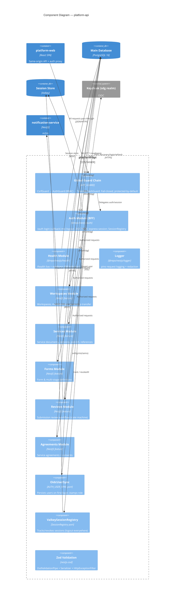

# C4 — Component Diagram: platform-api (Staff BFF)

Internal structure of the **platform-api** NestJS app. Cross-cutting concerns
(auth, health, logging) come from `@repo/nestjs`; feature modules live under
`src/modules/<feature>`. A chain of global guards enforces CSRF → auth → token
refresh on every request.

## Notes

- **Guard chain order matters:** `CsrfGuard` (Origin allowlist, opt-in) runs before
  `AuthGuard` (session → 401/403 by `@Roles`), which runs before `TokenRefreshGuard`
  (lazy, coalesced, rotation-aware; `invalid_grant` destroys the session).
- **Ports keep `@repo/database` out of `@repo/nestjs`:** the auth module calls back
  into app-provided `OidcUserSync` and `ValkeySessionRegistry` implementations.
- **Validation** is `nestjs-zod` globals (`APP_PIPE`/`APP_INTERCEPTOR`/`APP_FILTER`),
  with per-feature `createZodDto` classes; feature authz is per-resource in the service.
- `citizen-portal-api` has the **same** cross-cutting shape; its feature modules are
  the public `services` catalogue and the auth-only `/me/applications` lifecycle instead.
