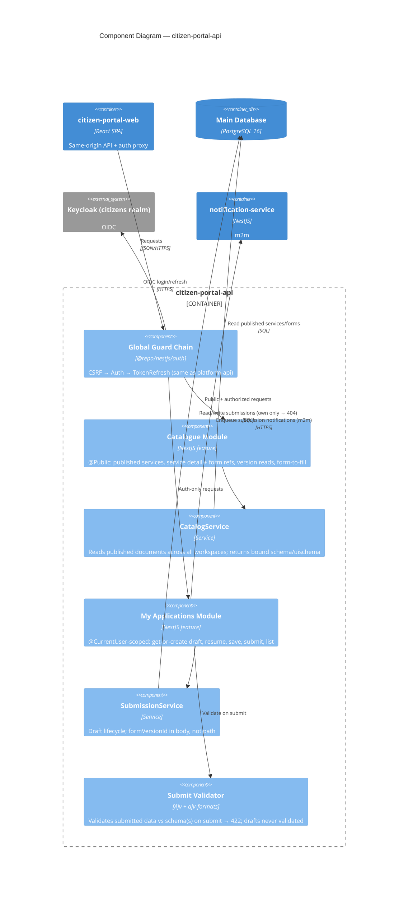

# C4 — Component Diagram: citizen-portal-api (Citizen BFF)

The citizen BFF is **workspace-free to the caller**. The organizing principle is the
public/private split: `/v1/services*` is the `@Public` catalogue; `/v1/me/applications*`
is auth-only and `@CurrentUser`-scoped. It reuses the same `@repo/nestjs` cross-cutting
stack as platform-api (auth/guard chain/health/logger omitted here for focus).

## Notes

- **Public vs private is the auth boundary.** The catalogue never surfaces a
  `workspace_id`; private writes hang off `/me`, not the public `services` tree.
- **Server is the real validator.** Client-side gating is best-effort; drafts are
  intentionally partial and only `submit` runs Ajv against the form's schema(s)
  (basic = one schema; multi-stage = every page's schema) → 422 on failure.
