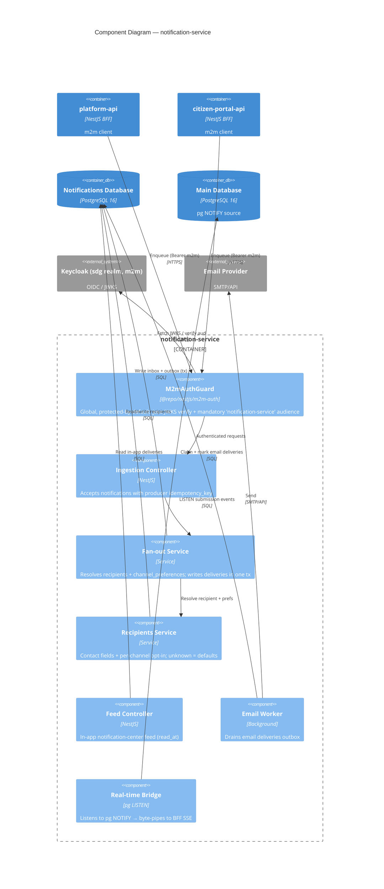

# C4 — Component Diagram: notification-service

A server-to-server app (no browser sessions). It ingests notifications into an
idempotent **inbox**, fans them out to a per-channel **outbox**, serves an in-app
feed, and drains an email worker. m2m tokens are validated against Keycloak with a
**mandatory audience** check.

## Notes

- **Users are never replicated.** `recipients.user_id` holds the shared `users.id`
  value as an opaque uuid — no FK, no cross-database join.
- **Inbox/outbox, no broker.** `notifications` is an append-only idempotent inbox
  (unique `idempotency_key`); `deliveries` is a per-channel outbox with a writable
  status state machine, pinned to its notification/recipient by composite FK.
- **Audience check is mandatory.** Issuer alone also matches staff login tokens, so
  the guard requires the `notification-service` audience specifically.
