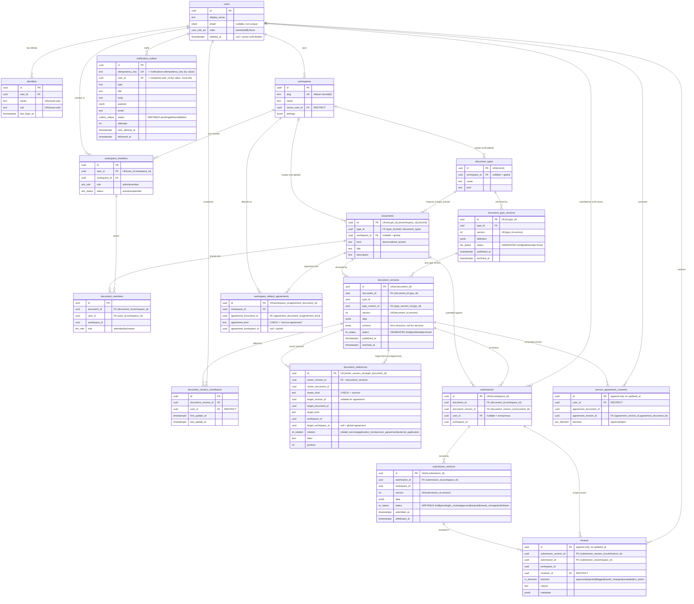
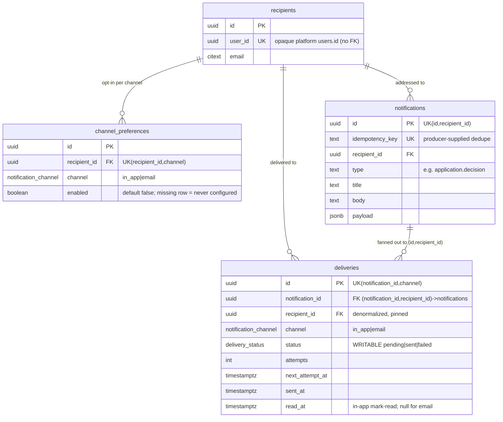
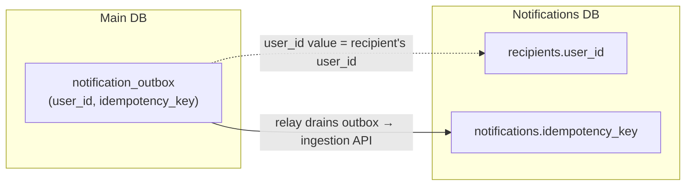

# Database Model — Main DB & Notifications DB

Entity-relationship diagrams for the two **physically separate** PostgreSQL databases,
derived from the Drizzle schemas (`packages/database/src/schema`,
`packages/notification-database/src/schema`).

Key conventions carried from the schema:

- All PKs are `uuid`; every mutable table has `created_at` / `updated_at` (append-only
  audit tables omit `updated_at`).
- Several relationships are enforced by **composite foreign keys** (e.g.
  `(type_id, kind)`, `(id, workspace_id)`) — the crow's-foot lines below show the
  logical parent→child link; the compositeness is noted where it matters.
- `status` on `*_versions` (documents/types) is a **GENERATED** column derived from
  timestamps; `submission_versions.status`, `deliveries.status`, `notification_outbox.status`
  are **writable** state machines.
- The two databases **never share an FK**. They are linked only **by value**:
  `notification_outbox.user_id` / `idempotency_key` → `recipients.user_id` /
  `notifications.idempotency_key`.

---

## 1. Main database (`@repo/database`)

Staff-authored catalogue (services / forms / agreements), citizens' submissions, reviews,
and the transactional notification outbox.

---

## 2. Notifications database (`@repo/notification-database`)

Physically separate Postgres. `recipients.user_id` holds the platform `users.id` **value**
as an opaque uuid — no FK, no cross-database join.

---

## Cross-database link (by value, never an FK)

Each BFF's relay drains `notification_outbox` (FOR UPDATE SKIP LOCKED) and POSTs to the
notification-service ingestion API. Integrity across the two databases is maintained
**by value** — the shared `user_id` and the `idempotency_key` (unique on both sides, so a
relay crash between POST and mark-delivered replays safely).
